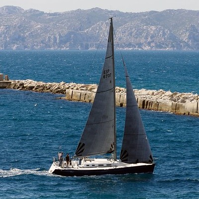
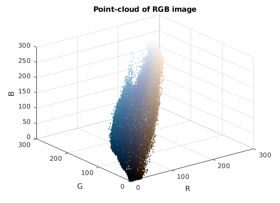

# Fusion with Sliced-Wasserstein Distance 

This code implement an algorithm for fusion between hyperspectral and multispectral images. 

## Inverse Problem framework 

The goal of fusion is to retrieve image $\hat{X} \in \mathbb{R}^{l_h\times p_m}$ in the hight spatial and spectral dimension space from $Y_m \in \mathbb{R}^{l_m\times p_m}$ the multispectral image and $Y_h \in \mathbb{R}^{l_h\times p_h}$ the hyperspectral image. In order to solve this inverse problem, we compute a Wasserstein barycenter between hyperspectral and multispectral information:

$$\hat{X} = \operatorname*{argmin}_{X \in \mathbb{R}^{l_h\times p_m}} \frac{1}{2} \{ \widehat{SW_2}(Y_m,L X)^2 + \widehat{SW_2}(Y_h,X B S)^2 \}.$$

Spatial and spectral degradation operators $S$ and $L$ are used with Gaussian blur operator $B$. A gradient descent is used to do the minimisation. It is implemented in the function fusion_SW.py
## Image view as a point cloud distribution

An image with $d$ spectral bands can be see as a point cloud distribution in a $d$-dimensional space.

 

## Sliced-Wasserstein distance 

The following Monte-Carlo approximation of the Sliced-Wasserstein distance [@Peyré, 2011] is used as distance:

$$ \widehat{SW_2}(\mu,\nu)^2 = \frac{1}{|\Psi|}\sum_{\theta \in \Psi} W_2(U_{|\theta},V_{|\theta})^2,$$

with $\mu$ and $\nu$ two distribution with support $U$ and $V$ respectively. $\Psi$ is a unit sphere of dimension $d$ and $W_2(\cdot,\cdot)$ the Wasserstein distance. The gradient has the following expression:

$$ \forall i \in [1,n], \qquad \frac{\partial \widehat{SW_2}(\mu,\nu)^{2}}{\partial U_i}=\frac{2}{|\Psi|} \sum_{\theta \in \Psi}\left\langle U_{i}-V_{s_{\theta}^{\star}(i)}, \theta\right\rangle \theta, $$

with $s_{\theta}^{\star}$ the optimal permutation. $s_v, s_u \in \Sigma_{n}$ denote the permutations that order the value of $\langle U_i | \theta \rangle$ and $\langle V_i | \theta \rangle$ respectively. Thoses equations are implemented in the file Sliced_Wasserstein.py

@inproceedings{peyré,
  TITLE = {{Wasserstein Regularization of Imaging Problems}},
  AUTHOR = {Rabin, Julien and Peyr{\'e}, Gabriel},
  URL = {https://hal.archives-ouvertes.fr/hal-00591279},
  BOOKTITLE = {{ICIP 2011 : 2011 IEEE International Conference on Image Processing}},
  ADDRESS = {Bruxelles, Belgium},
  PAGES = {?},
  YEAR = {2011},
  MONTH = Sep,
  KEYWORDS = {Variational model ; Energy minimization ; Image regularization ; Gradient descent ; color and contrast modification},
  PDF = {https://hal.archives-ouvertes.fr/hal-00591279/file/wasserstein_variational_prox.pdf},
  HAL_ID = {hal-00591279},
  HAL_VERSION = {v1},
}